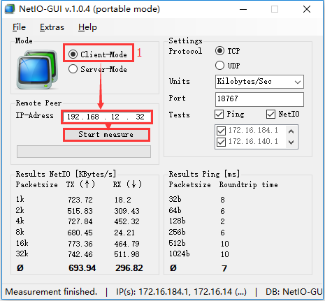

# NetIO：网络吞吐量测试工具

## 1、介绍

[NetIO](http://www.nwlab.net/art/netio/netio.html) 用于在 OS/2 2.x 、 Windows 、 Linux 和 Unix 上进行网络性能测试的工具。它会通过 TCP/UDP 方式，使用不同大小的数据包进行网络净吞吐量测试。

RT-Thread 目前支持的是 NetIO 服务器。

## 2、使用

### 2.1 启动 NetIO 服务器

需要在 RT-Thread 上使用 Finsh/MSH 命令来启动 NetIO 服务器，大致效果如下：

```
msh />netio_init
NetIO server start successfully
msh />
```

### 2.2 安装 NetIO-GUI 测试软件

安装文件位于 `/tools/netio-gui_v1.0.4_portable.exe` ，这个是绿色软件，安装实际上是解压的过程，解压到新文件夹即可。

### 2.3 进行 NetIO 测试

打开刚安装的 `NetIO-GUI` 软件，按如下操作进行配置：

- 打开 `NetIO-GUI.exe` ；
- 选择 `Client-Mode` 模式；
- 填写 NetIO 服务器的 IP 地址。可以在 RT-Thread 的 MSH 下使用 ifconfig 命令查看；
- 点击 `Start measure` 开始测试（测试前务必确保服务器可以被 PC ping 通）；
- 等待测试结束。结束后，不同数据包对应的收发测试结果将会在结果区域显示出来。


