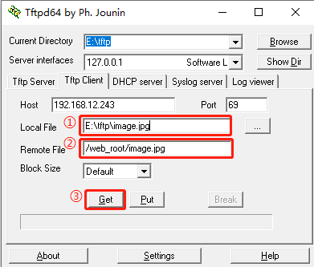

# TFTP：简单文件传输协议

## 1、介绍

[TFTP](https://baike.baidu.com/item/TFTP) （Trivial File Transfer Protocol, 简单文件传输协议）是 TCP/IP 协议族中的一个用来在客户机与服务器之间进行简单文件传输的协议，提供不复杂、开销不大的文件传输服务，端口号为 **69** ，比传统的 FTP 协议要轻量级很多，适用于小型的嵌入式产品上。

RT-Thread 目前支持的是 TFTP 服务器。

## 2、使用

### 2.1 安装 TFTP 客户端

安装文件位于 `/tools/Tftpd64-4.60-setup.exe` ，使用 TFTP 前，请先安装该软件。

### 2.2 启动 TFTP 服务器

在传输文件前，需要在 RT-Thread 上使用 Finsh/MSH 命令来启动 TFTP 服务器，大致效果如下：

```
msh />tftp_server
TFTP server start successfully.
msh />
```

### 2.3 传输文件

打开刚安装的 `Tftpd64` 软件，按如下操作进行配置：

- 1、选择 `Tftp Client` ；
- 2、在 `Server interfaces` 下拉框中，务必选择好与 RT-Thread 处于同一网段的网卡；
- 3、填写 TFTP 服务器的 IP 地址。可以使用 `ifconfig` 命令查看；
- 4、填写 TFTP 服务器端口号，默认： `69` 


#### 2.3.1 发送文件到 RT-Thread

- 1、在 `Tftpd64` 软件中，选择好要发送文件；
- 2、`Remote File` 是服务器端保存文件的路径（包括文件名），选项支持相对路径和绝对路径。由于 RT-Thread 默认开启 `DFS_USING_WORKDIR` 选项，此时相对路径是基于 Finsh/MSH 当前进入的目录。所以，使用相对路径时，务必提前切换好目录；
- 3、点击 `Put` 按钮即可。

如下图所示，将文件发送至 Finsh/MSH 当前进入的目录下，这里使用的是 **相对路径** ：


> 注意：如果 `DFS_USING_WORKDIR` 未开启，同时 `Remote File` 为空，文件会将保存至根路径下。

#### 2.3.2 从 RT-Thread 接收文件

- 1、在 `Tftpd64` 软件中，填写好要接收保存的文件路径（包含文件名）；
- 2、`Remote File` 是服务器端待接收回来的文件路径（包括文件名），选项支持相对路径和绝对路径。由于 RT-Thread 默认开启 `DFS_USING_WORKDIR` 选项，此时相对路径是基于 Finsh/MSH 当前进入的目录。所以，使用相对路径时，务必提前切换好目录；
- 3、点击 `Get` 按钮即可。

如下所示，将 `/web_root/image.jpg` 保存到本地，这里使用的是 **绝对路径** ：

```
msh /web_root>ls           ##查看文件是否存在
Directory /web_root:
image.jpg           10559                    
msh /web_root>
```


